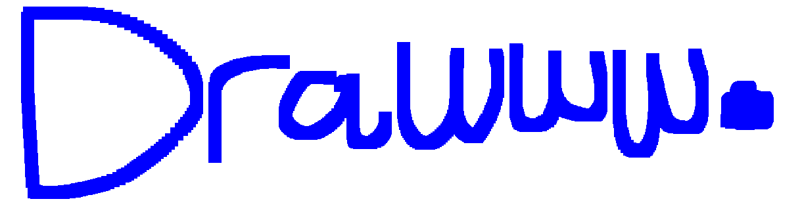
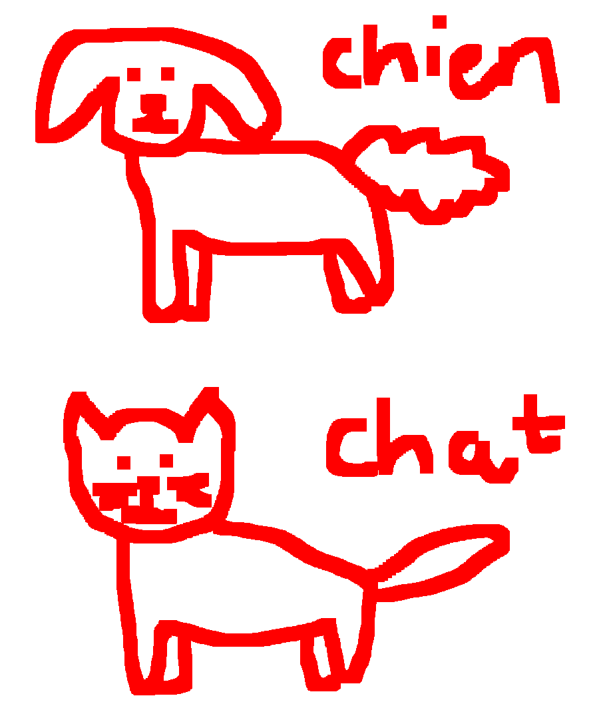

# Drawww



Drawww is a drawing library and program built with OpenGL. It provides a minimal canvas for drawing with a mouse.

It's inspired by the OG MS Paint as seen on Windows XP.

## Features

- ⚡️ Blazing fast renders @ 60-120 FPS
- 🌐 WebAssembly support (WIP)

## Usage

The program can be compiled and ran with the below command:

```
make build
```

## Examples

Here's a cool illustration made with Drawww:



## License

Drawww is provided under the MIT license. See the LICENSE file for details.
